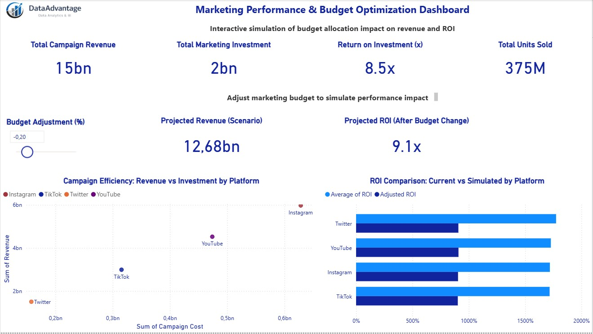

# 📊 Marketing Performance & Budget Optimization Dashboard (Power BI)

## 🚀 Overview

This project presents an interactive Power BI dashboard designed to analyze marketing campaign performance and simulate the impact of budget changes on revenue and ROI.

The dashboard goes beyond traditional reporting by enabling **scenario-based decision-making** through a built-in budget optimization simulator.

---

## 🎯 Business Problem

Marketing teams often struggle to answer:

* Which channels deliver the highest ROI?
* How should marketing budgets be reallocated?
* What is the expected impact of budget changes?

This dashboard addresses these questions with **data-driven insights and simulation capabilities**.

---

## 🔥 Key Feature: Budget Optimization Simulator

The dashboard includes an interactive **What-if analysis tool** that allows users to:

* Adjust marketing budget dynamically
* Simulate changes in revenue and ROI
* Evaluate different investment scenarios

💡 The model incorporates **diminishing returns logic**, making projections more realistic.

---

## 📊 Key Metrics

* Total Campaign Revenue: **15B+**
* Total Marketing Investment: **2B+**
* ROI: **8.5x**
* Total Units Sold: **375M+**

---

## 📈 Dashboard Features

* KPI overview (Revenue, Investment, ROI, Sales)
* Campaign efficiency analysis (Revenue vs Investment)
* ROI comparison by platform (current vs simulated)
* Budget scenario simulation (What-if parameter)
* Channel-level performance insights

---

## 🧠 Data Modeling

* Marketing cost estimated using reach-based modeling

* Revenue calculated from product sales

* ROI defined as:
  `ROI = (Revenue - Cost) / Cost`

* Scenario modeling includes:

  * Budget adjustment parameter
  * Non-linear revenue scaling (diminishing returns)

---

## 🛠 Tools & Technologies

* Power BI
* DAX (Data Analysis Expressions)
* Data Modeling
* Data Visualization

---

## 📂 Dataset

* Influencer Marketing ROI Dataset (Kaggle)
* Includes:

  * Campaign performance metrics
  * Platform and category data
  * Engagement, reach, and sales

---

## ▶️ How to Use

1. Download the `.pbix` file
2. Open in Power BI Desktop
3. Use the **Budget Adjustment slider** to simulate different scenarios
4. Analyze changes in ROI and revenue

---

## 💡 Key Insights

* High revenue channels are not always the most efficient
* Budget changes significantly impact ROI outcomes
* Diminishing returns affect scaling performance
* Scenario simulation supports smarter budget allocation

---

## 👤 Author

Dmytro Kalinin
Data Analyst | Power BI | Marketing Analytics

---

## ⭐ Feedback

If you found this project useful, feel free to star the repository ⭐

